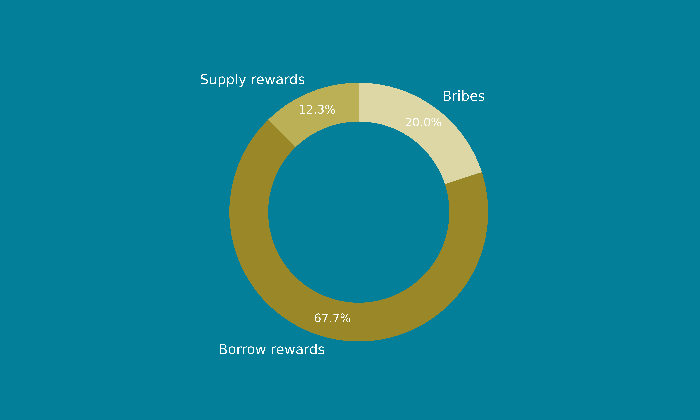
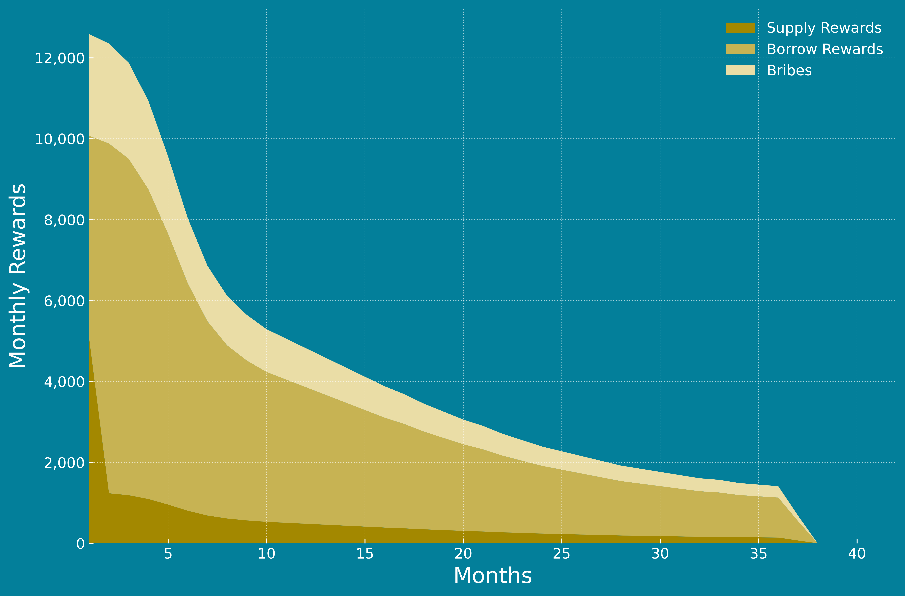

# Incentive Program

## **Overview**

The Rosa Finance Incentive Program is a robust initiative designed to foster liquidity, engagement, and alignment within the decentralized finance ecosystem, emphasizing collaboration with XXX. Through strategic incentives for participation in both borrowing and supplying, as well as a close partnership with XXX, this program aims to drive growth and create a thriving community around Rosa Finance on the Arbitrum network.

## **Incentive Program Allocation**

### **ROSA Allocation**

A total of 162,000 ROSA tokens (27% of the total supply) have been allocated to the Incentive Program to fuel the next growth phase for Rosa Finance, demonstrating a firm commitment to the community and the broader decentralized finance ecosystem.

### Incentives Breakdown

<figure><figcaption></figcaption></figure>

The reward allocation composition within Rosa Finance's Incentive Program is strategically designed to foster different aspects of the protocol. Bribes on XXX are allocated 20% of the rewards, equivalent to 32,400 ROSA tokens, to incentivize liquidity provision. Borrowers are given a substantial portion, comprising 70% or 113,400 ROSA tokens, to encourage borrowing activities on the platform. Finally, suppliers are allocated 10%, amounting to 16,200 ROSA tokens, to motivate liquidity provision to Rosa Finance itself. Together, these allocations form a coherent strategy to drive growth, enhance liquidity, and promote active engagement across the various facets of the protocol.

* **Bribes on XXX (20%, 32,400 ROSA tokens)**
* **Borrowers (70%, 113,400 ROSA tokens)**
* **Suppliers (10%, 16,200 ROSA tokens)**


**First Month Special Allocation**: During the initial month, the allocation will be specially tailored to bootstrap liquidity on the supply side, fostering early adoption and engagement within the platform.

* Bribes: 20%
* Borrowers: 40%
* Suppliers: 40%


## **Emission Schedule**

The ROSA token emission will follow a deliberately planned three-year schedule, decrementing on a monthly basis. This schedule aims to align Rosa Finance's growth with sustainability, ensuring fairness and ongoing incentives.

<figure><figcaption>
$ROSA emissions over month. y-axis represents $ROSA amount, x-axis represents time (every 1 tick represents 30-days)
</figcaption></figure>

## **Collaboration with XXX**

### **Protocol Owned Liquidity on XXX**

Rosa Finance actively engages in XXX bribe marketplace, encouraging liquidity provision in the ROSA/USDC pool through economic incentives known as "bribes."

### **Bribes**

1. **Direct Participation for ROSA Holders**: : ROSA holders can engage in Liquidity Providing (LPing) on XXX, earning additional rewards and adding depth to the liquidity of the ROSA/USDC pool.
2. **Increased Protocol Revenue and Redistribution**: Through LPing on XXX, Rosa Finance earns additional revenue paid in XXX, which is then distributed to stROSA holders, enhancing the overall protocol profitability.

### **Benefits for Rosa Finance**

1. **Transparent Engagement**: Bribes are made and held in escrow until the epoch's completion, ensuring transparency.
2. **Strategic Leveraging**: By utilizing XXX offerings, Rosa Finance stimulates liquidity and participation.

## **Program Highlights**

* **Transparency**: Complete openness in the design with all details available to the community.
* **Governance**: Active participation from community members in shaping Rosa Finance's future.
* **Sustainability**: Emphasizing long-term viability through steady emission reductions.

The Rosa Finance Incentive Program embodies the commitment to a thriving community, laying the groundwork for substantial growth and development on Arbitrum. By incentivizing participation through thoughtfully structured rewards, it sets a trajectory for sustainable growth and robust engagement with the platform.
