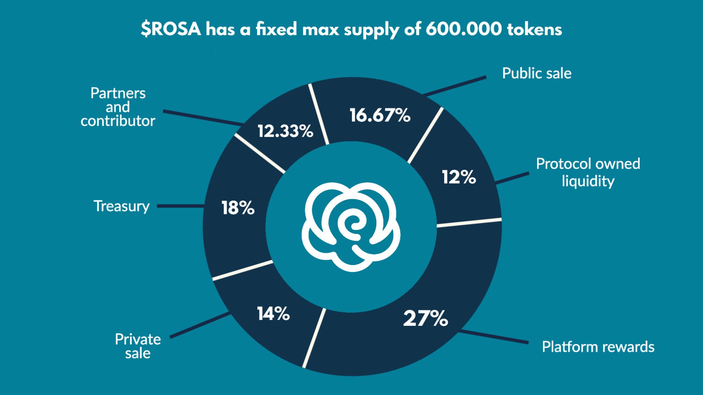

# Protocol Tokenomics

## **Rosa Finance Tokenomics Overview**

The $ROSA token underpins the entire Rosa Finance ecosystem and plays a critical role in governance, liquidity provision, rewards, and more.

### Maximum Supply

The total and immutable maximum supply of $ROSA tokens is capped at 600,000. All tokens are minted upon deployment, with no additional minting functionality. This finite supply is securely dispatched to various contracts and multisignature wallets to ensure the protocol's integrity and alignment with the following distribution plan:

### Token Distribution

The distribution of the total supply of $ROSA is thoughtfully allocated to drive the ecosystem's growth and stability. Here's a detailed breakdown:

1. **Protocol-owned Liquidity (12% / 72,000 $ROSA):** Earmarked to enhance liquidity on partnered decentralized exchanges within the Arbitrum ecosystem. This supports fluid trading and efficient price discovery.
2. **Platform Rewards (27% / 162,000 $ROSA):** Allocated to incentivize user participation, these tokens will be systematically distributed over a three-year period to various staking, lending, and borrowing activities, complying with our incentive program.
3. **Treasury (18% / 108,000 $ROSA):** Reserved for the ongoing development of the protocol. This includes, but is not limited to, funding research, development, marketing, and strategic initiatives.
4. **Partners and Contributors (12.33% / 74,000 $ROSA):** Dedicated to rewarding ecosystem partners, collaborators, and early supporters. This allocation will be distributed in both $ROSA and the staked version, $sROSA, according to transparent and predefined agreements.
5. **Private LBE (14% / 84,000 $ROSA):** Allocated at a rate of $2.70 per token to accredited investors and early backers during the Liquidity Bootstrapping Event, catalyzing initial growth.
6. **Public LBE (16.67% / 100,000 $ROSA):** Made available at $3.00 per token during the public Liquidity Bootstrapping Event, promoting widespread access and participation.

<figure><figcaption></figcaption></figure>

## **Commitment to Transparency and Integrity**

Rosa Finance's tokenomics reflects a commitment to transparency, security, and a community-driven approach. The hard cap and precise distribution model are meticulously designed to foster sustainable growth and value across the platform's diverse financial services.
